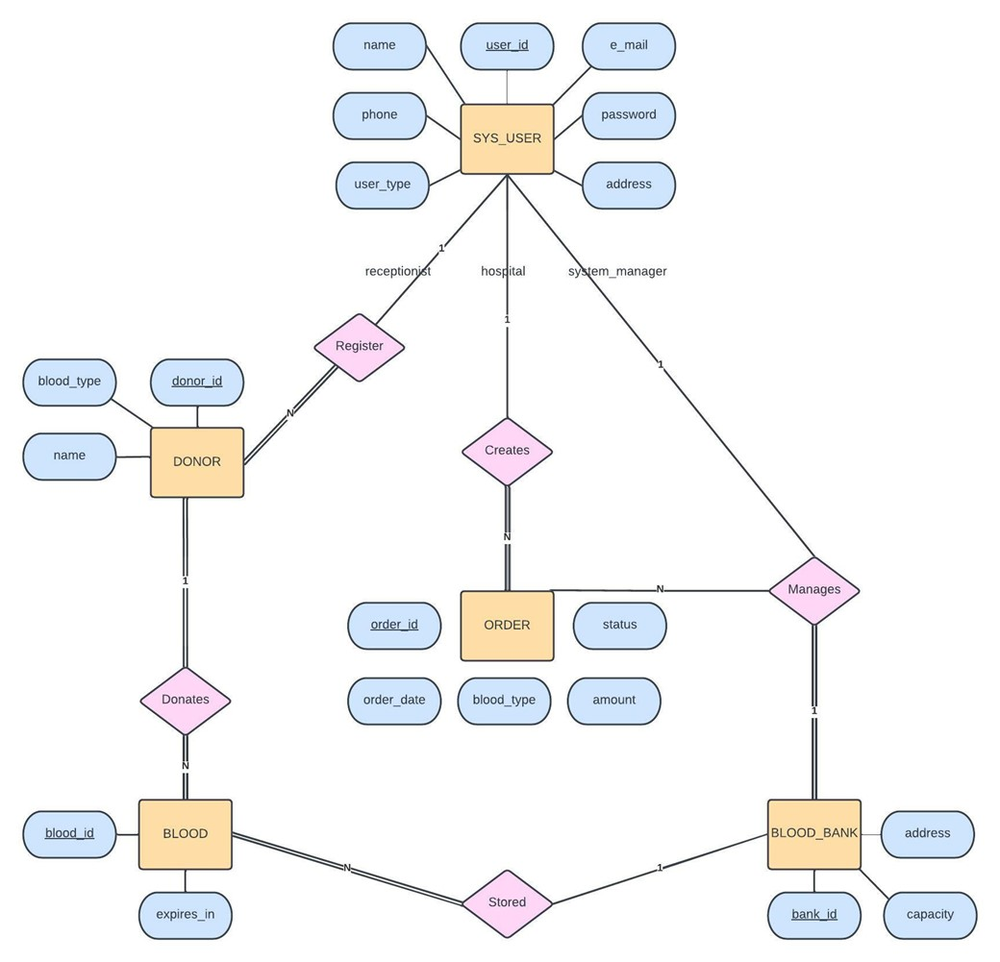
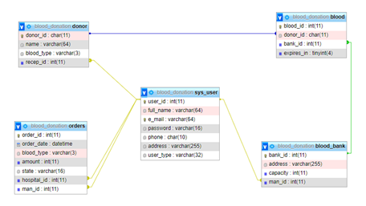

# BLOOD DONATION SYSTEM

__NOTE 1__: See the report.pdf file to see all the stages of developing our application.

__NOTE 2__: This application was developed with node.js v16.0.0.
If you do not have this version or higher versions of node.js on your computer, please download it. 
I may not work in lower node versions.


## How to Run?

1. First, run the create_db.sql file in your MySQL engine to create the required database on your local host and edit the database information in the .env file in the server folder.

2. After making sure your database is up and running, open your terminal in the "application" directory.

3. Then run the following commands in order to run the node.js server.

```
cd server
npm i
npm start
```

4. To run the React application, open a new terminal in the "application" directory and run the following commands in the following order.

```
cd server
npm i
npm start
```
5. That's it! To open the application, enter the address below in your browser.

http://localhost:3000/

## Entity Relationship Diagram


## Database Schema
